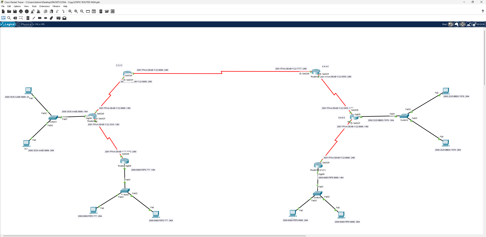

# Static Router IPv6 (High AD / Floating Static Routes)

## 📖 الوصف
مشروع يطبق **التوجيه الساكن على IPv6** باستخدام مسارات احتياطية ذات مسافة إدارية عالية (**Floating Static Routes / High Administrative Distance**) — تُستخدم كمسار بديل يعمل فقط في حال فشل المسار الأساسي (Primary Route).

## 🗺️ التصميم (Topology)

نفس هيكلية شبكة IPv6 المستخدمة في مشاريع أخرى: 6 راوترات مترابطة عبر روابط Serial بعناوين IPv6 كاملة، وكل راوتر يخدم شبكة LAN مستقلة، مثل:
- `2000:3535:AAEE:9999::/64`
- `2000:6060:FEFE:7777::/64`
- `2000:2525:BBDD:7878::/64`
- `2000:6060:FEFE:8888::/64`

## ⚙️ المفاهيم المطبقة
- كتابة مسارات ساكنة IPv6 أساسية (Primary Static Routes)
- إضافة مسارات احتياطية بمسافة إدارية أعلى (**Floating Static Route**) تُستخدم فقط عند تعطل الرابط الأساسي
- اختبار التبديل التلقائي (Failover) بين المسار الأساسي والاحتياطي
- فهم مفهوم **Administrative Distance** ودوره في اختيار أفضل مسار

## 🎯 الهدف من المشروع
تطبيق سيناريو احترافي للتعافي من الأعطال (Redundancy/Backup Path) في شبكات IPv6 الساكنة، بحيث تستمر الشبكة بالعمل تلقائيًا عند انقطاع الرابط الأساسي دون تدخل يدوي.

## 📂 الملف
- [`Static-Router-High.pkt`](./Static-Router-High.pkt) — ملف Packet Tracer الكامل
